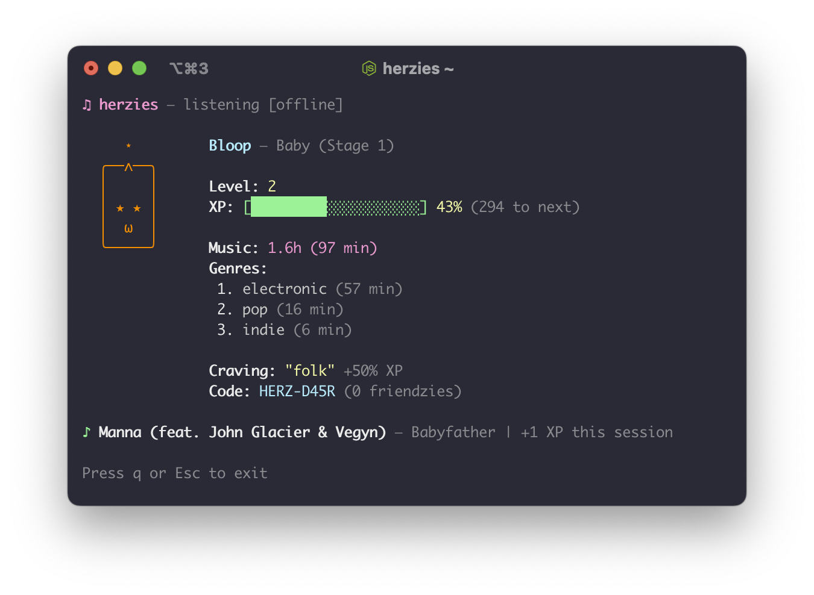

```
 _                   _
| |                 (_)
| |__   ___ _ __ _____  ___  ___
| '_ \ / _ \ '__|_  / |/ _ \/ __|
| | | |  __/ |   / /| |  __/\__ \
|_| |_|\___|_|  /___|_|\___||___/
```
A CLI pet that grows by listening to music.

<p align="center">
 
</p>

## Install

```sh
npm i -g herzies
```

## Usage

```sh
herzies hatch       # create your herzie
herzies register    # create an account
herzies login       # log in
herzies run         # start listening
herzies status      # check on your herzie
herzies friends     # manage friends
```
